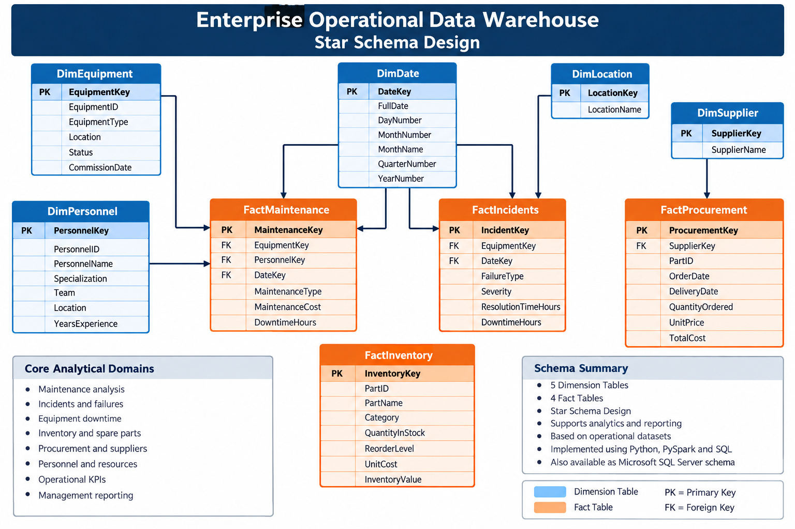
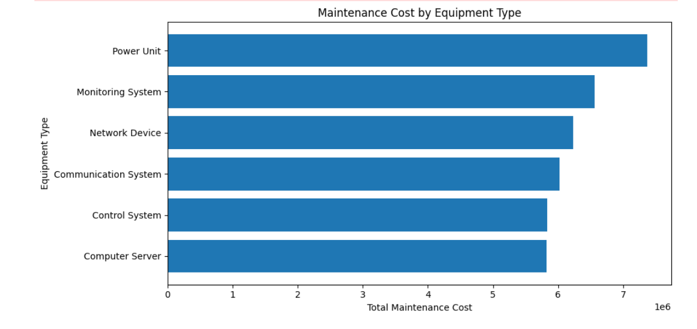
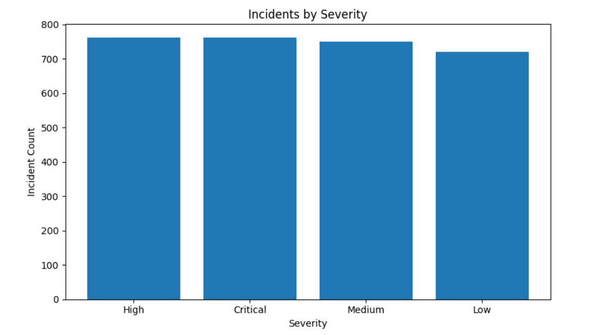
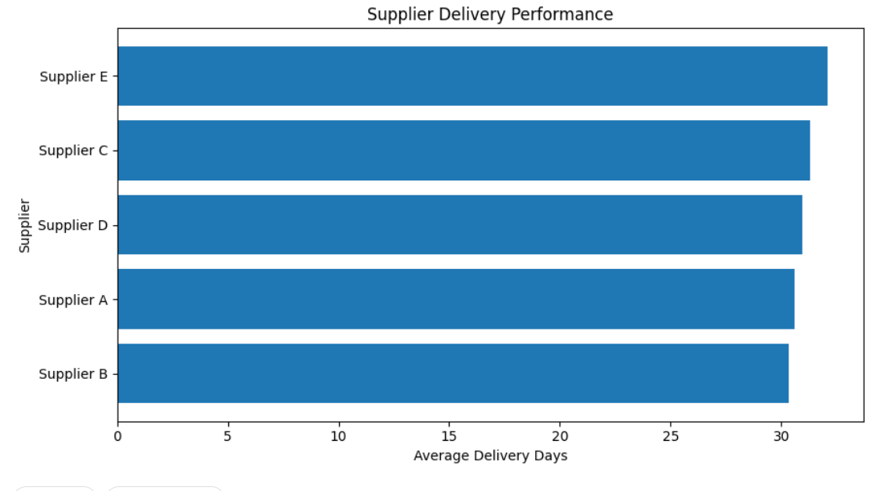

# Enterprise Operational Data Warehouse & Analytics Pipeline

End-to-end operational data engineering project using Python, PySpark, Spark SQL, ETL, data quality validation, dimensional modeling, star schema, analytics and management reporting.

## Project Status

**Completed**

### Final Results

- 21,802 raw operational records
- 21,773 clean records after ETL
- 18 data-quality issues detected
- 5 dimension tables
- 4 fact tables
- 9 warehouse tables
- 7 management reports

## Architecture

Synthetic Operational Data  
→ PySpark Ingestion  
→ Data Quality Validation  
→ ETL & Cleaning  
→ Dimensional Modeling  
→ Star Schema  
→ Spark SQL Analytics  
→ Management Reports

## Star Schema




## Project Overview

The project simulates operational data from a large technical organization covering:

- Equipment and asset records
- Maintenance history
- Incident and failure records
- System performance logs
- Personnel and resources
- Inventory and spare parts
- Procurement and supplier activity

All datasets are synthetic. No confidential or real operational information is used.

## Architecture

Synthetic Operational Data  
↓  
PySpark Data Ingestion  
↓  
Data Quality Validation  
↓  
ETL & Cleaning  
↓  
Dimensional Modeling  
↓  
Star Schema  
↓  
Spark SQL Analytics  
↓  
Management KPIs & Reports

## Technologies

- Python
- PySpark
- Spark SQL
- Pandas
- ETL / Data Integration
- Data Quality Validation
- Data Warehousing
- Dimensional Modeling
- Star Schema
- Parquet
- Git & GitHub
- Data Analytics
- Management Reporting

## Project Results
## Final Pipeline Results

| Metric | Result |
|---|---:|
| Raw Operational Records | 21,802 |
| Clean Records After ETL | 21,773 |
| Data Quality Issues Detected | 18 |
| Dimension Tables | 5 |
| Fact Tables | 4 |
| Warehouse Tables | 9 |
| Management Reports | 7 |
The completed pipeline produced:

- 21,802 raw operational records
- 21,773 clean records after ETL
- 18 data-quality issues detected
- 5 dimension tables
- 4 fact tables
- 9 warehouse tables
- 7 management analytical reports

## Data Quality Checks

The validation layer detects:

- Missing business keys
- Duplicate records
- Invalid foreign keys
- Negative maintenance costs
- Invalid availability percentages
- Negative inventory quantities
- Missing operational values

## Dimensional Model
## Star Schema

The analytical warehouse uses a dimensional star-schema design with five dimension tables and four fact tables.


The schema supports maintenance, incident, inventory and procurement analytics while connecting operational events to equipment, personnel, dates, locations and suppliers.
### Dimension Tables

- DimEquipment
- DimDate
- DimLocation
- DimPersonnel
- DimSupplier

### Fact Tables

- FactMaintenance
- FactIncidents
- FactInventory
- FactProcurement

## Business Analytics

The warehouse supports analysis of:

- Equipment failure frequency
- Maintenance cost
- Equipment downtime
- Incident severity
- Resolution time
- Inventory reorder risk
- Supplier delivery performance
- Operational KPIs

## Management Outputs

The project generates the following reports:

- `data_quality_report.csv`
- `management_kpis.csv`
- `incident_severity.csv`
- `maintenance_by_equipment_type.csv`
- `supplier_performance.csv`
- `top_failure_equipment.csv`
- `reorder_parts.csv`

## Dashboard Visualizations
## Dashboard Visualizations

### Maintenance Cost by Equipment Type


### Incidents by Severity


### Supplier Delivery Performance

The repository includes management-ready charts for:

- Maintenance cost by equipment type
- Incidents by severity
- Supplier delivery performance

## Repository Structure

```text
enterprise-operational-data-warehouse/
│
├── README.md
├── requirements.txt
├── .gitignore
│
├── notebooks/
│   └── enterprise-operational-data-warehouse-analytics.ipynb
│
├── src/
│   └── generate_data.py
│
├── reports/
│   ├── data_quality_report.csv
│   ├── management_kpis.csv
│   ├── incident_severity.csv
│   ├── maintenance_by_equipment_type.csv
│   ├── supplier_performance.csv
│   ├── top_failure_equipment.csv
│   └── reorder_parts.csv
│
├── dashboard/
│   ├── maintenance_cost_by_equipment_type.png
│   ├── incidents_by_severity.png
│   └── supplier_delivery_performance.png
│
├── sql/
├── docs/
└── data/

## Project Documentation

- [Architecture](docs/architecture.md)
- [Data Dictionary](docs/data_dictionary.md)
- [Star Schema Documentation](docs/star_schema.md)
- [Project Results](docs/project_results.md)
- [Interview Preparation Guide](docs/interview_cheat_sheet.md)

## Documentation

- [Architecture](docs/architecture.md)
- [Data Dictionary](docs/data_dictionary.md)
- [Star Schema](docs/star_schema.md)
- [Project Results](docs/project_results.md)
- [Interview Preparation](docs/interview_cheat_sheet.md)

## Author

**Ahmed Abdelhamid Elsisi**

Data & AI / Technical Leadership

GitHub: https://github.com/ahmedmohamed850
